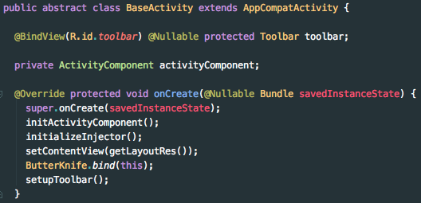
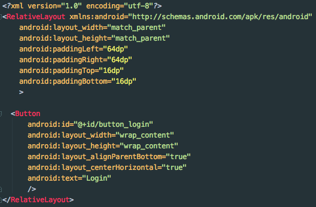

# Material Theme

Material theme is an Android Studio / Intellij IDEA colorscheme based on
https://github.com/equinusocio/material-theme

## Instalation

1. Copy `material_theme.icls` to your Android Studio preferences color directory.

   *The colors directory may need to be created.*

   **Mac OS X**
   * `~/Library/Preferences/AndroidStudioX.X/colors`.

1. Restart Android Studio

1. Got to `Preferences | Editor | Colors & Fonts` and select the `material_theme`

## Screenshots

